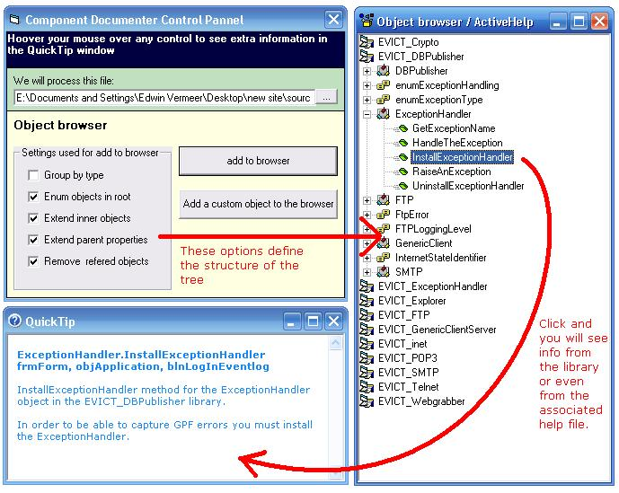



## ObjectBrowser and QuickTip control

### Description

In this publication there are 2 very nice reusable controls. The ObjectBrowser and the QuickTip

- - - - - - - - - - - - - - - - - - - - - - - - - - - - - - - - - - - -

The ObjectBrowser control lets you have a look at the structure of any OLE/COM. The TLBINF32.dll. is used to get this information.

This can be an ActiveX dll, an OCX or an ActiveX EXE. It's even possible to read out the entire object model of any MS Office application.

All functionality is located in just one user control. It's easy to embed that in any application.

The object browser control will give you about the same information as the object broweser that is build in Visual Studio 6.

Also have a look at ComDoc at http://www.evict.nl/comdoc/.

ComDoc is an application for generating chm help files that is based on this object browser together with my database publishing dll that you can find on http://www.dbpublisher.com

The sourcecode of ComDoc will be released soon.

- - - - - - - - - - - - - - - - - - - - - - - - - - - - - - - - - - - -

The QuickTip control adds a help function to your application.

There is even support for getting the help text out of a chm help file.

At this moment I only have one demo for that and that is in the siteskinner dll that you can download (for free) from http://www.siteskinner.com

- - - - - - - - - - - - - - - - - - - - - - - - - - - - - - - - - - - -

Credits: The object browser is based on the article : MSDN Magazine, December 2000 by Jason Fisher. See: http://msdn.microsoft.com/msdnmag/issues/1200/TypeLib/default.aspx

The QuickTip is inspired by the HotHelp feature in HotHTML from Thushan Fernando. See http://www.wsoftware.biz/
 
### More Info
 

             |
---                |---
**Submitted On**   |2005-09-24 00:22:50
**By**             |[Edwin Vermeer\.](https://github.com/Planet-Source-Code/PSCIndex/blob/master/ByAuthor/edwin-vermeer.md)
**Level**          |Intermediate
**User Rating**    |5.0 (40 globes from 8 users)
**Compatibility**  |VB 6\.0
**Category**       |[Libraries](https://github.com/Planet-Source-Code/PSCIndex/blob/master/ByCategory/libraries__1-49.md)
**World**          |[Visual Basic](https://github.com/Planet-Source-Code/PSCIndex/blob/master/ByWorld/visual-basic.md)
**Archive File**   |[ObjectBrow19396410122005\.zip](https://github.com/Planet-Source-Code/edwin-vermeer-objectbrowser-and-quicktip-control__1-62862/archive/master.zip)

